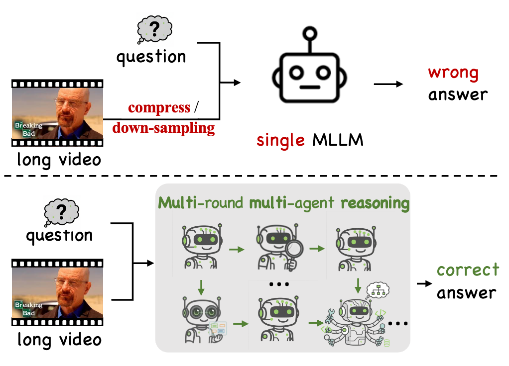
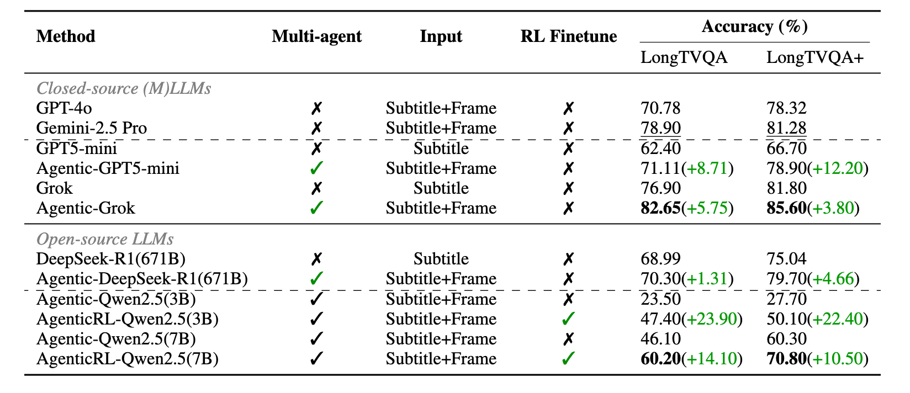
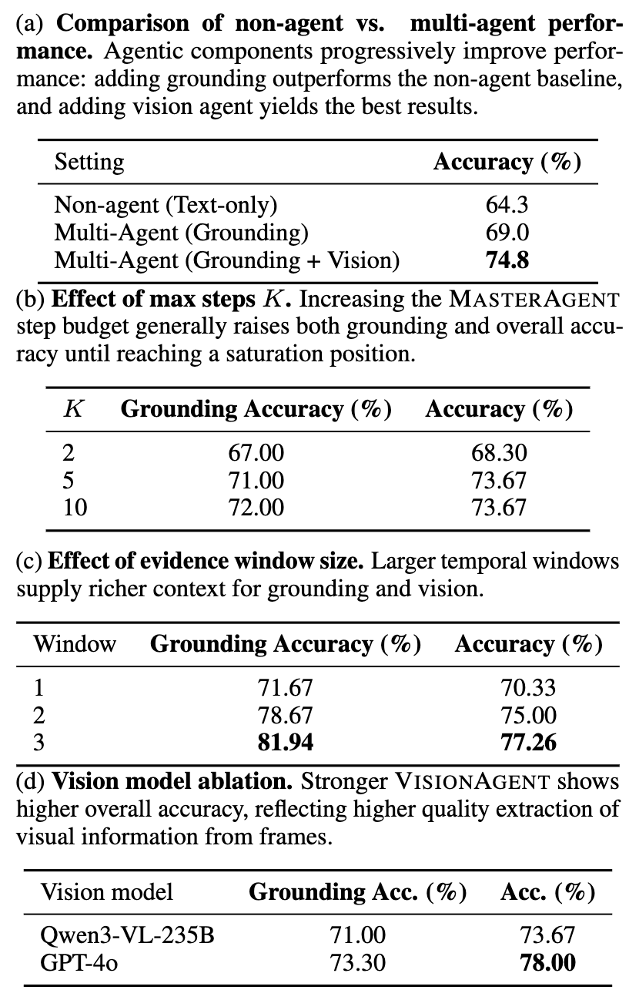

# 🎬LongVideoAgent: Multi-Agent Reasoning with Long Videos

<div align="center">

 [中文](./README_zh.md) | [📚 Docs](https://longvideoagent.github.io/LongVideoAgent/) | [Project Page](https://longvideoagent.github.io/) | [Arxiv](https://arxiv.org/abs/2512.20618)

Runtao Liu\*, Ziyi Liu\*, Jiaqi Tang, Yue Ma, Renjie Pi, Jipeng Zhang, Qifeng Chen

Hong Kong University of Science and Technology

\* Equal contribution

</div>

---

This is the official repository for [arXiv](https://arxiv.org/abs/2512.20618). Training and evaluation code are now available. This README provides a compact code overview, while the [📚 Docs](https://longvideoagent.github.io/LongVideoAgent/) contain the full setup, workflow, and argument details.

## 🚀 Latest News
• `[2026/03/06]:` 🚀 We released the **training** and **evaluation** code for **LongVideoAgent**.

• `[2026/02/14]:` 📦 We released the **LongTVQA** dataset on [Hugging Face](https://huggingface.co/datasets/longvideoagent/LongTVQA).

• `[2025/12/30]:` 📦 We released the **LongTVQA+** dataset on [Hugging Face](https://huggingface.co/datasets/longvideoagent/LongTVQA_plus).

• `[2025/12/24]:` 🚀 We released our paper "LongVideoAgent: Multi-Agent Reasoning with Long Videos" on [arXiv](https://arxiv.org/abs/2512.20618)!

---

## 📅 Roadmap
- [x] **[2026/03/06]**: Released training and evaluation code.

---
## 📦 Dataset
- **LongTVQA**: [https://huggingface.co/datasets/longvideoagent/LongTVQA](https://huggingface.co/datasets/longvideoagent/LongTVQA)
- **LongTVQA+**: [https://huggingface.co/datasets/longvideoagent/LongTVQA_plus](https://huggingface.co/datasets/longvideoagent/LongTVQA_plus)

---

## 🛠️ Installation
We recommend creating a clean Python 3.11 environment and installing the project from the repository root:

```bash
conda create -n lvagent python=3.11
conda activate lvagent
pip install -e .
pip install flash-attn --no-build-isolation
pip install wandb
```

If dependency resolution fails, you can install the package first without dependencies and then install from `requirements.txt`:

```bash
pip install -e . --no-deps
pip install -r requirements.txt
```

For step-by-step installation details, see [docs/installation.md](docs/installation.md).

---

## 🏋️ Train
The recommended training flow is: prepare datasets, build an offline grounding cache, convert data to GRPO parquet files, and then launch the quickstart script.

### 1. Download and prepare LongTVQA assets

```bash
bash scripts/download_and_prepare_longtvqa.sh
```

### 2. Build the offline grounding cache

```bash
python src/dataset/build_grounding_cache.py \
  --dataset tvqa_plus \
  --questions-path /path/to/train.json \
  --subs-path /path/to/all_episodes_subtitles_by_clips.json \
  --grounding-model "grok-4-fast-reasoning" \
  --grounding-base-url "https://api2.aigcbest.top/v1" \
  --output-dir /path/to/cache_dir \
  --threads 8
```

### 3. Convert the dataset to training parquet files

```bash
python src/dataset/convert_tvqa_json_to_grpo_parquet.py \
  --questions-path /path/to/LongTVQA_or_LongTVQA_plus_questions.jsonl_or_json \
  --grounding-cache-json /path/to/grounding_cache.json \
  --subtitles-dir /path/to/subtitles_dir \
  --output-dir ./data \
  --seed 42
```

### 4. Launch quickstart GRPO training

```bash
bash scripts/quickstart_qwen_2_5_3B_grpo.sh
```

The quickstart script expects `./data/train.parquet` and `./data/val.parquet`. Grounding and vision API credentials can be passed by CLI or read from environment variables in the training pipeline.

For more detailed training instructions, see [Quickstart](docs/training/quickstart.md), [Offline Grounding Cache](docs/training/offline-grounding-cache.md), [Convert to Parquet](docs/training/convert-to-parquet.md), and [GRPO Config Details](docs/training/grpo-config-details.md).

---

## 📊 Eval
LongVideoAgent provides unified local and API evaluation scripts for both LongTVQA and LongTVQA+.

### Unified local evaluation

```bash
python src/evaluation/lvagent/evaluate_local_unified.py \
  --dataset tvqa_plus \
  --llm-path "/path/to/your/local_llm" \
  --max_turn 5 \
  --gpu_memory_utilization 0.4
```

### Unified API evaluation

```bash
python src/evaluation/lvagent/evaluate_api_unified.py \
  --dataset tvqa_plus \
  --checkpoint_step api \
  --max_turn 5 \
  --threads 30
```

To prepare evaluation-ready dataset files, you can also run:

```bash
bash scripts/download_and_prepare_longtvqa.sh
```

If API keys are not passed explicitly, the evaluation scripts read them from environment variables such as `qdd_api` and `aliyun_api`.

For full evaluation setups and argument descriptions, see [docs/evaluation.md](docs/evaluation.md).

---

## 📝 Abstract
Recent advances in multimodal LLMs and systems that use tools for long-video QA point to the promise of reasoning over hour-long episodes. However, many methods still compress content into lossy summaries or rely on limited toolsets, weakening temporal grounding and missing fine-grained cues. We propose **LongVideoAgent**, a multi-agent framework in which a master LLM coordinates a grounding agent to localize question-relevant segments and a vision agent to extract targeted textual observations. The master agent plans with a step limit, and is trained with reinforcement learning to encourage concise, correct, and efficient multi-agent cooperation. This design helps the master agent focus on relevant clips via grounding, complements subtitles with visual detail, and yields interpretable trajectories. On our proposed **LongTVQA** and **LongTVQA+** which are episode-level datasets aggregated from TVQA/TVQA+, our multi-agent system significantly outperforms strong non-agent baselines. Experiments also show reinforcement learning further strengthens reasoning and planning for the trained agent.

---

## 🌟 Overview
Traditional single-pass MLLMs that ingest entire long videos in one context—typically (may through heavy downsampling and compression) often miss crucial evidence and produce wrong answers, whereas **LongVideoAgent** conducts *multi-agent*, *multi-round*, and *multimodal* reasoning to extract sparse, task-relevant cues and answer correctly.

<p align="center">
  
</p>

---

## 🤖 Method: Multi-Agent Framework


Architecture of **LongVideoAgent**. A **MasterAgent** runs for up to $K$ rounds, collaborating with a **GroundingAgent** to localize relevant clips from videos and a **VisionAgent** to read fine-grained cues from the localized frames. Evidence accumulates until the **MasterAgent** feels confident to answer the user.

### 🔄 Iterative Reasoning Loop
Unlike single-pass models, LongVideoAgent operates in a bounded loop (max $K$ steps). At each step, the **MasterAgent** generates a "thinking" trace and emits a structured action token:
- `<request_grounding>`: Calls the **GroundingAgent** to localize relevant video segments based on subtitles. The agent returns a symbolic tag `<clip_X>`.
- `<visual_query>`: Calls the **VisionAgent** to extract specific visual details (objects, actions, text) from the localized clip. The agent returns textual observations.
- `<answer>`: Terminates the loop and provides the final response when sufficient evidence is gathered.

### 🧠 Reinforcement Learning (GRPO)
We optimize the MasterAgent using Group Relative Policy Optimization (GRPO). The training objective includes: 1.  Structural validity. 2.  Answer Correctness: Rewarding the agent for reaching the correct final answer.

---

## 📈 Experimental Results
We evaluate LongVideoAgent on **LongTVQA** and **LongTVQA+**, which are episode-level datasets.

### Main Results
Performance on *LongTVQA* and *LongTVQA+*. The left block lists model attributes (*Agentic*, *Input*, *RL fine-tune*); the right block reports validation accuracy (%). GPT-4o and Gemini-2.5 Pro are *multimodal* baselines that process and accept the full long video directly. Methods labeled `Agentic` indicate the model operates as the MasterAgent; methods labeled `AgenticRL` additionally denote RL fine-tuning. Parenthesized green numbers denote absolute gains over the immediately preceding (non-agentic or non-RL) setting. We observe that: (i) our multi-agent framework, **LongVideoAgent**, consistently outperforms the non-agentic counterparts; (ii) agentic RL yields additional gains, especially for smaller open-source models; (iii) using frames provides visual evidence beyond subtitles, and generally outperforms subtitle-only inputs; (iv) closed-source models remain strong, but the gap narrows much when open-source models adopt agentic designs and agentic RL.

<p align="center">
  
</p>

### 🔍 Ablation Analysis
We conduct comprehensive ablation studies to validate our design choices. First, we observe that both grounding and vision agents are essential, with the full multi-agent system achieving the highest accuracy. Second, increasing the reasoning step limit $K$ improves performance until saturation, confirming the value of iterative planning. Finally, stronger vision backbones and larger temporal windows provide richer context, further boosting the agent's reasoning capabilities.

<p align="center">
  
</p>

---

## 📝 Citation
If you find our work helpful, please cite:
```bibtex
@misc{liu2025longvideoagentmultiagentreasoninglong,
      title={LongVideoAgent: Multi-Agent Reasoning with Long Videos}, 
      author={Runtao Liu and Ziyi Liu and Jiaqi Tang and Yue Ma and Renjie Pi and Jipeng Zhang and Qifeng Chen},
      year={2025},
      eprint={2512.20618},
      archivePrefix={arXiv},
      primaryClass={cs.AI},
      url={https://arxiv.org/abs/2512.20618}, 
}
```

---
