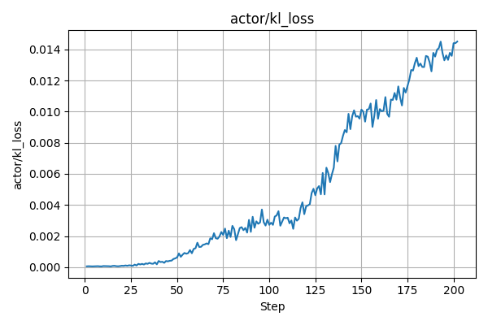
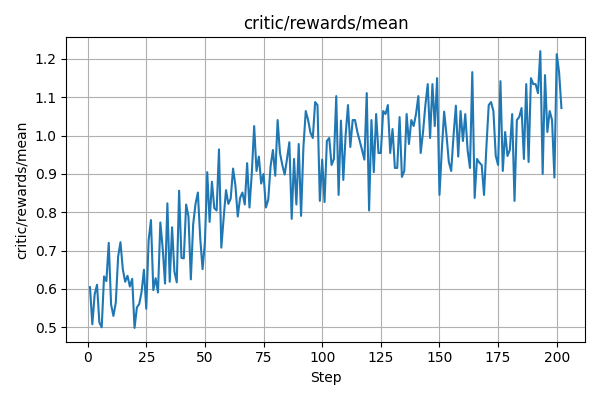

# Quickstart

Use this workflow to prepare data and launch a quick GRPO run with Qwen2.5-3B-Instruct.

## 1. Download and preprocess LongTVQA data

This step downloads required question/subtitle files and extracted frames.

```bash
bash scripts/download_and_prepare_longtvqa.sh
```

## 2. Build offline grounding cache (recommended)

This step performs initial clip localization and writes a cache for later training use.

```bash
python src/dataset/build_grounding_cache.py \
  --dataset tvqa_plus \
  --questions-path /path/to/train.json \
  --subs-path /path/to/all_episodes_subtitles_by_clips.json \
  --grounding-model "grok-4-fast-reasoning" \
  --grounding-base-url "https://api2.aigcbest.top/v1" \
  --output-dir /path/to/cache_dir \
  --threads 8
```

## 3. Start quickstart training

This step launches training.

```bash
bash scripts/quickstart_qwen_2_5_3B_grpo.sh
```

For the `verl_new` migration path (official agent loop + reward loop), use:

```bash
bash scripts/train_qwen_2_5_7B_grpo_verl_new.sh
```

## Reference Metrics (for quickstart runs)

The following figures are provided as reference from successful runs. They are not strict convergence targets, but useful sanity checks:

- `actor_kl_loss`: should generally stay bounded and avoid long-term divergence spikes.
- `critic_rewards_mean`: should show a stable upward trend (with normal short-term fluctuations).

### actor_kl_loss (reference)



### critic_rewards_mean (reference)


